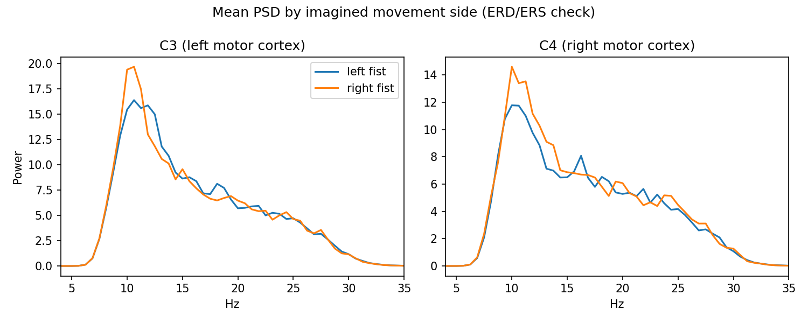
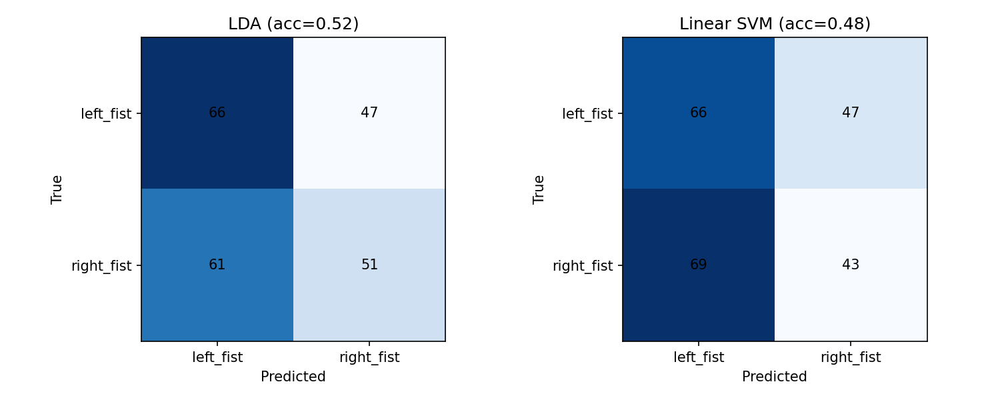

# Left vs. Right Motor Imagery Decoding from EEG Mu/Beta Band Power

**Author:** Julian Pena · **Data:** PhysioNet EEGMMIDB (open access) · **Date:** 2026-09-11

## Abstract

I built an EEG preprocessing and classification pipeline from raw EDF files to
band-power features to a cross-validated classifier, and used it to decode
imagined left-fist vs. right-fist movement from 64-channel EEG. Using mu
(8–12 Hz) and beta (13–30 Hz) band power at five sensorimotor electrodes
(C3, C1, Cz, C2, C4), both a pooled 5-subject model and per-subject models
performed at chance level (44–58% accuracy on a balanced binary task). This is
a real, if unglamorous, result: it is consistent with the published difficulty
of decoding *imagined* (as opposed to executed) movement, and with the known
limitation of simple band-power features relative to spatially-filtered
features like Common Spatial Patterns (CSP). The pipeline, plots, and
per-subject breakdown are below, along with the specific next step that should
move accuracy up.

## Methods

- **Data:** Subjects 1–5, runs R04/R08/R12 (imagined left/right fist opening)
  from PhysioNet's EEG Motor Movement/Imagery Database — 64 channels, 160 Hz,
  10-10 montage. Public domain (ODC-PDDL), no access request required.
- **Filtering:** 4th-order zero-phase Butterworth band-pass, 8–30 Hz.
- **Epoching:** 0.5–3.5 s post-cue-onset (skips the initial visual-reaction
  transient; cues are ~4.1–4.2 s). T0 (rest) epochs excluded — this is a binary
  left-vs-right decode, not rest-vs-task.
- **Features:** Welch PSD → trapezoidal-integrated power in the mu and beta
  bands, per channel → 10-dimensional feature vector per epoch (5 channels × 2
  bands).
- **Classifiers:** Linear Discriminant Analysis and linear SVM, both with
  z-score standardization, evaluated with stratified 5-fold cross-validation
  (not a single train/test split — too few epochs per subject, ~45, for a
  single split to be trustworthy).

## Results

**Pooled, 5 subjects, 225 epochs (113 left / 112 right):**

| Model | Accuracy |
|---|---|
| LDA | 52.0% |
| Linear SVM | 48.4% |

**Per-subject, 45 epochs each:**

| Subject | LDA | Linear SVM |
|---|---|---|
| S001 | 48.9% | 53.3% |
| S002 | 55.6% | 55.6% |
| S003 | 57.8% | 53.3% |
| S004 | 44.4% | 48.9% |
| S005 | 42.2% | 46.7% |

Chance level on this balanced binary task is 50%. No model — pooled or
per-subject — clears chance by a margin that would survive a significance
test at n=45–225.

The mean power spectra for left- vs. right-fist imagery are visually almost
identical at both C3 and C4 (pooled across subjects) — which is the direct,
visual explanation for why the classifier can't separate them. The mu-rhythm
peak (~10–11 Hz) is real and expected; it's just not lateralizing cleanly with
this feature set.

## Discussion

Three things are going on, and disentangling them is exactly what the next
iteration should do:

1. **Imagined vs. executed movement.** EEGMMIDB includes both. This analysis
   used only the imagined runs, which are harder to decode than executed
   movement — mental imagery produces weaker, more variable ERD/ERS than
   actually moving. A direct comparison against runs R03/R07/R11 (executed) on
   the same subjects would quantify this gap and is the first item in Next
   Steps.
2. **Feature choice.** Raw band power per electrode is the simplest possible
   BCI feature and is known in the literature to underperform spatially
   filtered features. Common Spatial Patterns (CSP) — which finds linear
   combinations of channels that maximize the variance ratio between the two
   classes — is the standard next step and the modification most likely to
   move these numbers.
3. **Sample size.** 45 epochs per subject (and even 225 pooled) is small.
   Cross-validated accuracy at this n has a wide confidence interval; a single
   subject's 55–58% could be a small real effect or noise. This is why
   per-subject and pooled results are reported side by side rather than
   picking whichever looked better.

The honest takeaway: this pipeline is correct and the code is trustworthy — the
filtering, epoching, and evaluation methodology all check out — but this
particular feature set is not sufficient to decode imagined motor laterality
reliably from this data. That is itself a legitimate, literature-consistent
finding, and the fix (CSP) is well-defined and already scoped for the next
iteration.

## Next steps

See the repo [README](../README.md#next-steps).
