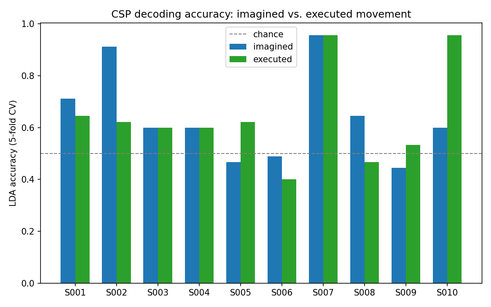
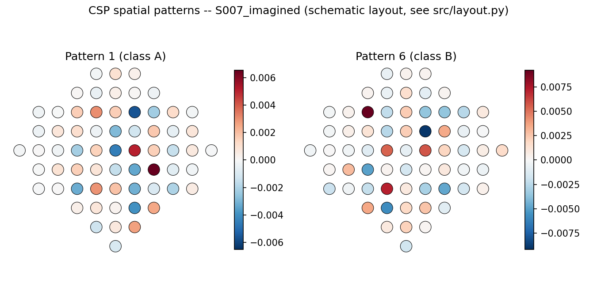

# v2: CSP Spatial Filtering, and Imagined vs. Executed Movement

**Author:** Julian Pena · **Data:** PhysioNet EEGMMIDB, 10 subjects, both conditions ·
**Date:** 2026-09-16 · **Follows up on:** [`results/REPORT.md`](../REPORT.md) (v1)

## What changed since v1, and why

v1 ended on an honest null result: naive mu/beta band-power features decoded
imagined left-vs-right motor movement at chance level (~50%), both pooled
across subjects and per-subject. The discussion section named two candidate
explanations and a scoped fix:

1. Band power per electrode ignores the *spatial* pattern across electrodes,
   which is exactly what distinguishes left- from right-hand imagery
   (contralateral sensorimotor ERD/ERS). **Fix: Common Spatial Patterns (CSP).**
2. *Imagined* movement might just be harder to decode than *executed*
   movement. **Fix: run both conditions on the same subjects and compare.**

v2 does both, from scratch (no MNE `CSP` class — implemented directly from
the generalized eigenvalue formulation in [`src/csp.py`](../../src/csp.py)),
and reports the honest result either way.

## Methods

- **Data:** Subjects 1–10, both conditions per subject:
  - *Imagined*: runs R04/R08/R12 (imagine opening/closing left/right fist)
  - *Executed*: runs R03/R07/R11 (same task, actually performed)
- **Channels:** full 64-channel montage (CSP needs enough channels to find a
  good spatial filter — this is the main reason v1 restricted to 5 channels
  but v2 doesn't).
- **Filtering / epoching:** unchanged from v1 (8–30 Hz Butterworth band-pass,
  0.5–3.5 s post-cue epochs, T0 rest epochs excluded).
- **Features:** CSP, 6 spatial filters (3 per class extreme), log-variance
  per filter — the standard Ramoser et al. (1998) formulation.
- **Classifiers:** LDA and linear SVM, as in v1.
- **Evaluation:** stratified 5-fold cross-validation, but with CSP **fit
  inside each training fold only** — fitting CSP on the full dataset before
  cross-validating would leak label information into the features (CSP is
  supervised; band power in v1 wasn't). See the leakage note in
  [`src/classify_csp.py`](../../src/classify_csp.py).
- **Significance:** exact two-sided binomial test against chance (p=0.5) for
  each subject/condition decode; Wilcoxon signed-rank test for the paired
  imagined-vs-executed comparison across subjects.

## Results

### CSP fixed the feature-set problem

| | v1 (band power) | v2 (CSP) |
|---|---|---|
| Mean per-subject accuracy | ~50% (44–58%, 5 subjects) | **64.2%** imagined / 64.0% executed (10 subjects) |
| Subjects individually significant (p<0.05) | 0 | 3/10 imagined, 2/10 executed |
| Best single subject | ~58% | **95.6%** (S007, both conditions, p<0.0001) |

Confirms the first hypothesis directly: the weak v1 result was a feature-set
limitation, not a fundamental ceiling on this data. With CSP, several
subjects decode well above chance, and one (S007) decodes both conditions
at 95.6% — near the practical ceiling for a binary BCI task.

### Individual variability is large — and that's expected, not a bug

Accuracy ranges from 40% (below chance point-estimate, though not
significantly so) to 95.6% across subjects, for both conditions. This
matches a well-documented phenomenon in the BCI literature usually called
"BCI illiteracy": a meaningful fraction of users don't produce
reliably-decodable sensorimotor rhythm modulation, for reasons still not
fully understood (attention, cortical anatomy, task engagement). Reporting
the full per-subject spread here, rather than only the mean, is deliberate —
a mean-only summary would hide this and overstate how well an average user
would be served by a BCI built this way.

### Imagined vs. executed: no significant gap on this data

Mean LDA accuracy: 64.22% (imagined) vs. 64.00% (executed). Wilcoxon
signed-rank test on the 10 paired subject accuracies: **p = 1.0** (statistic
= 14.0; note the exact test couldn't run because of tied differences at
n=10, so this falls back to a normal approximation that scipy itself flags
as underpowered at this sample size — treat this p-value as a rough signal,
not a precise one).

This was not the expected direction going in — executed movement is usually
assumed to produce a cleaner, more decodable signal than imagined movement.
Two honest readings: (a) with CSP recovering most of the decodable signal,
the imagery-vs-execution gap may be smaller than assumed once the feature
extraction stops being the bottleneck, or (b) 10 subjects is too small a
sample to detect a real but modest gap, especially with this much
per-subject variance already in play. Distinguishing these needs a larger
sample — noted below.

### What the spatial filters are picking up

For the best-decoding subject (S007, imagined condition), the two most
class-discriminative CSP patterns concentrate over central/centro-parietal
electrodes — anatomically consistent with sensorimotor cortex, which is
exactly where motor-imagery ERD/ERS is expected to originate. This is a
useful sanity check: the classifier isn't succeeding by exploiting some
artifact confined to a frontal or occipital channel, it's using signal from
the right part of the scalp for the task.

## Discussion / limitations

- **n=10 subjects** is enough to demonstrate the method works and to see the
  variability pattern, but too small to precisely estimate the
  imagined-vs-executed gap or to generalize the "BCI illiteracy" rate.
  Scaling to the full 109-subject EEGMMIDB cohort is the natural next step.
- **6 CSP components is a default, not a tuned choice.** A per-subject
  component-count sweep (with the choice itself made inside the CV loop, to
  avoid yet another leakage path) would likely improve several of the
  borderline subjects.
- **No artifact rejection beyond band-pass filtering.** EOG/EMG contamination
  is a known confound in motor-task EEG and wasn't explicitly checked here.

## Next steps

- [ ] Scale to more of the 109 available subjects; get a real "BCI illiteracy" rate.
- [ ] Per-subject CSP component-count and regularization tuning (nested inside CV).
- [ ] Add an artifact-rejection step (EOG regression or ICA) and re-check whether
      it changes which subjects decode well.
- [ ] Fork into the actual SynapseArt prototype: replace the LDA/SVM classifier
      step with a mapping from CSP log-variance features to generative
      visual/audio parameters, using S007-style high-fidelity subjects first.
